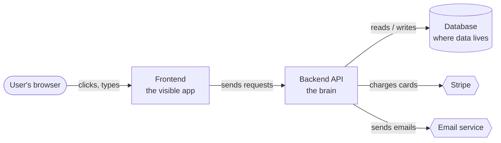
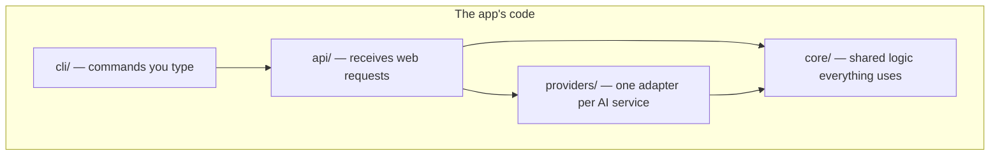
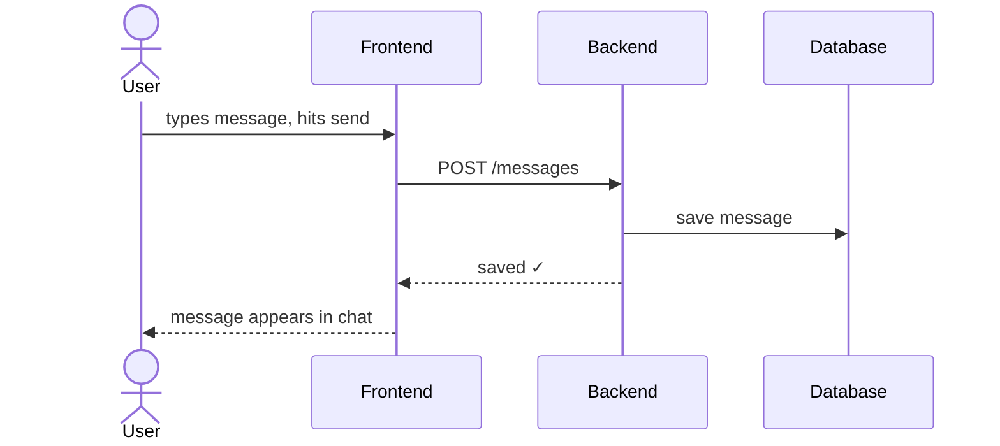
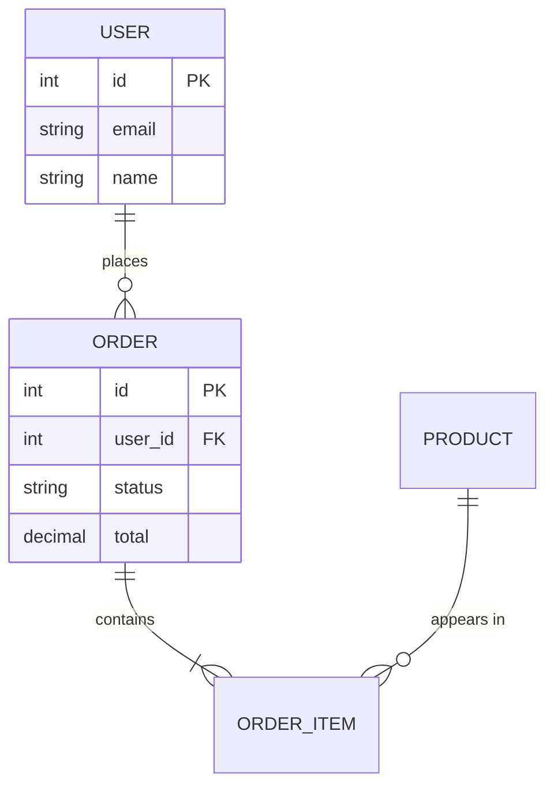
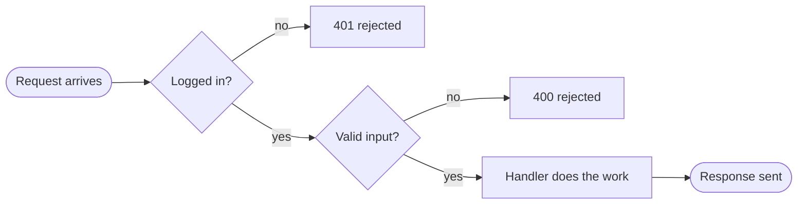
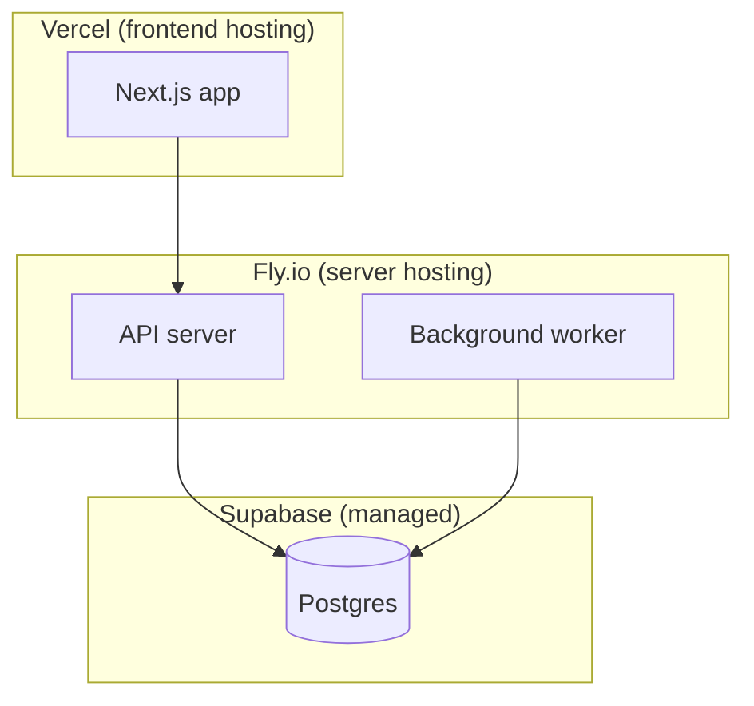

# Diagram patterns — which diagram, when, and how

Every diagram must pass the **grandma test**: a smart non-programmer should get the
gist in 10 seconds from the shapes and labels alone.

## Universal style rules

- `%% caption: <one plain-English sentence>` as the FIRST line of every `.mmd` file.
  The renderer prints it under the title in the PDF.
- Max ~12 nodes. Over that: split into overview + zoom-in diagrams.
- Edge labels are verbs: `-->|saves the order|`, `-->|asks for prices|`.
- Node labels are roles, not filenames: `Payments (talks to Stripe)`, not `stripe.ts`.
  Put the filename in parentheses only when the human will need to find it.
- Group related nodes with `subgraph` blocks named in plain English
  ("Runs on your server", "Third-party services", "The database").
- Use a consistent shape language:
  - `([User])` stadium — people
  - `[Service]` rectangle — code you own
  - `[(Database)]` cylinder — storage
  - `{{External API}}` hexagon — third-party services
- Theme: default/neutral. No custom colors unless distinguishing "your code" vs
  "external" (then: one classDef for external, light gray fill).

## 1. System overview (always) — `flowchart LR`

The 30,000-foot view. User on the left, external services on the right.

## 2. Module map (always) — `flowchart TD`

Top-level folders as boxes, arrows = "imports from / calls". Answers "what is each
folder for and what talks to what". Derive edges from actual imports, not guesses.

## 3. Primary data flow (always) — `sequenceDiagram`

ONE user action, end to end. Pick the action the app exists for (checkout for a shop,
send-message for a chat app). Number of participants ≤ 6.

## 4. ERD (if data layer exists) — `erDiagram`

Source it from migrations / ORM models / `schema.prisma` / SQL files — never from
imagination. Include: table names, relationships with cardinality, and only the
5–8 most meaningful columns per table (id, foreign keys, the "business" fields).
Skip timestamps/updated_at noise.

NoSQL: still use `erDiagram` — collections as entities, embedded docs as
`||--|{ ... : embeds`.

## 5. Request lifecycle (if server) — `flowchart LR`

The gauntlet a request runs: middleware, auth, validation, handler, response.
Show error exits as dashed arrows.

## 6. Deployment (if infra config exists) — `flowchart TB`

Where each piece physically runs. Source from Dockerfile, docker-compose, vercel.json,
fly.toml, terraform, CI deploy steps. Subgraph per platform/host.

## Optional extras (only when clearly present)

- **State machine** (`stateDiagram-v2`): order status, job lifecycle, auth session —
  when the code has an explicit status/state enum with transitions.
- **Event flow** (`flowchart` with queue hexagons): pub/sub, webhooks, background
  jobs — when there's a queue/broker (Redis, SQS, Celery, BullMQ).
- **C4-style context** (`C4Context` if mermaid version supports it, else flowchart):
  for multi-service systems / monorepos with several deployables.

## Anti-patterns

- One mega-diagram with 30 nodes. Split it.
- Diagramming the file tree verbatim. The module map shows ROLES, not `ls` output.
- Unlabeled arrows. An arrow without a verb is a guess the reader has to make.
- Class diagrams of every class. Vibe-coders don't need UML; they need "what talks
  to what and why".
- Copying example diagrams from this file into output. These are shape references;
  every real diagram comes from the actual code.
